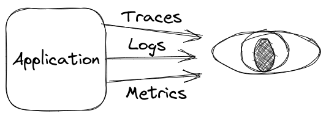

# Observability

Observability is a crucial aspect of modern software systems. In essence, it is the ability to understand what is happening within a system in real-time in the production environment, by collecting and analyzing different kind of signals. There could be different data sources such as logs, metrics and/or traces. Observability enables you to proactively identify and resolve issues before they become critical, making it a crucial tool for maintaining system reliability, resilience, and performance.

## Why observability is important for you?
Observability is essential in today's complex software environments for several reasons. Firstly, it allows for quicker and more effective troubleshooting when issues arise, reducing the mean time to resolution (MTTR). Secondly, it enables you to gain insights into your system's performance, usage, and behavior, helping you to optimize and improve your system's design and architecture.

Some situations where observability is a game-changer:
* High traffic web applications, where even small performance issues can have a significant impact on user experience and revenue.
* Cloud-based microservices, where many interconnected services make it challenging to identify the root cause of issues and monitor system behavior.
* Distributed systems, where many components interact with each other and where issues can quickly propagate throughout the system.

With one single instance of our application, observability was important to reduce the time to identify possible issues in our system. Imagine how important it is now, since we have hundreds of containers running instances of our microservices in different clouds with thousands of users accessing them. Systems are complex. And complexity increases the probabilities of creating a catastrophe.

Observability is based on: disaster cannot be avoided. There will always be:
* Human error
* Network issues
* Outages
* Unstested code paths
* Corner cases

We need to be ready for issues to avoid them or, at least, recover from them as fast as possible. Each minute our system is not working, is money our company is losing.

## The free pillars of observability
If your application is observable, you should be able to detect where the problem originated by checking the outputs. What outputs?

### Traces
A trace is a visualization of the events in your system showing the calling relationship between the events. This visualization includes information like the timing data for each event. The individual events are called "spans".

Using them, you can get what functions were called in your code or when one microservice connected a database to retrieve some information. And something really important: you can get how much time is spent in the different operations. Distributed tracing helps to do profiling of your system in production.

### Metrics
They consist of a single numeric value tracked over time. We have used them in monitoring systems for years: CPU usage, memory, disk performance… But all this information gives us an incomplete view of what is happening in our system.

Observable systems include the concept of "application performance monitoring". This new concept proposes to track application level metrics like average load times, error rates, requests per second, time to perform operations against third party services… providing a real picture of what the user experiences.

Each metric tracks only one variable, which makes them more efficient to send and store.

### Logs
Logs are text strings written to the terminal or to a file. You can generate these logs directly by printing information on the screen. But there are libraries that can help you to structurate that data to print information depending on the importance level (it is not the same as a debug message than an error message, for instance).

Los aggregation services allow you to send these messages to a central place to store them. Later, you can retrieve that data and extract information about what is happening in your system.

### The 6 pillars of observability
Traditionally, there were 6 pillars of observability but, in this [post, Yuri Shkuro](https://medium.com/@YuriShkuro/temple-six-pillars-of-observability-4ac3e3deb402) gives his point of view and extends the signals to 6.